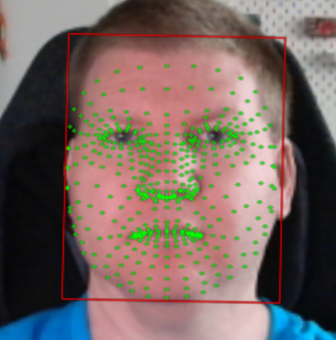
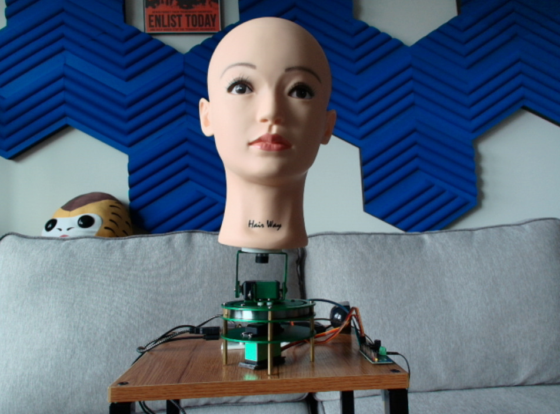
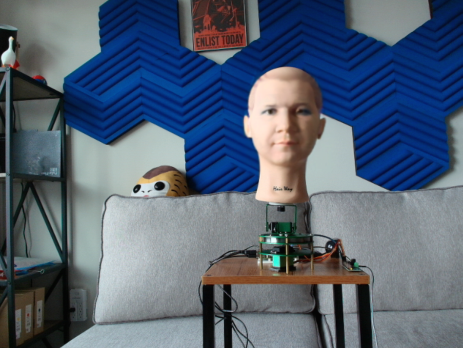

# deepfakeBot

This is a project made for the [AI Village](https://aivillage.org/) at [DEFCON 33](https://defcon.org/) to show off how deepfakes work and let attendees play around and interact with different real time generation methods.  

This is example uses [DeepfakeLab](https://github.com/iperov/DeepFaceLab) for synthetic video generation and [ElevenLabs](https://beta.elevenlabs.io/) for synthetic audio generation.  The code is designed to be run on raspberry pi, with a companion computer running the deepfake generation.  This computer can be anything from an old laptop to modern desktop.  In the example below both the deepfaked audio and video are of myself.  You can use any image or audio set you like, but please get consent from the person you are deepfaking.  This is meant to be a fun example of how easy it is to create deepfakes, and not a tool for malicious use.  

# Table of Contents
- [What are Deepfakes?](#what-are-deepfakes)
- [Creating Deepfakes](#creating-deepfakes)
  - [Facial Landmark Detection](#facial-landmark-detection)
  - [Face Alignment and Swapping](#face-alignment-and-swapping)
- [Detecting Deepfakes](#detecting-deepfakes)
  - [Color Histogram Analysis](#color-histogram-analysis)
- [Audio Deepfakes](#audio-deepfakes)
- [Detecting Audio Deepfakes](#detecting-audio-deepfakes)
  - [Spectrogram Analysis](#spectrogram-analysis)
- [Equipment and Setup](#equipment-and-setup)
  - [Running the Example](#running-the-example)
- [Conclusion](#conclusion)

# What are Deepfakes?

Deepfakes are one of the most well-known and infamous examples of synthetic video generation, with numerous high-profile cases of their misuse. At their most basic, deepfakes are videos that have been manipulated to replace one person's likeness with another's.  Over the years, they have evolved from only being able to edit pre-recorded videos to being able to generate real-time video streams. However, despite the bad reputation deepfakes have earned in the media, their origin is relatively benign. The models used to generate deepfakes are based on ones used by the animation industry for motion capture, which is one of the reasons why they are both so effective and so easy to use. 

Unlike many other synthetic video generation models, deepfakes can be created with relatively little data, and run on almost any modern computer. This makes them accessible to a wide range of users, from hobbyists to professionals.

In this example, we will be performing a 2D face replacement, which is the most common type of deepfake.  This is the technique most often referenced in the media, as it only requires a single image of the target face to create the deepfake.  In our case, we will be using an old headshot of myself, and projecting it onto a mannequin head.  

## Facial Landmark Detection

Our first step in this technique is to detect the facial features of the host face, in this case me.  This is done using a facial landmark detection model, which identifies key points on the face such as the eyes, nose, and mouth. In our case, we're using YOLOv5, a relatively older model.  

| Example of Facial Landmark Detection |
|:-----------------------------------:|
|  |
| An example of facial landmark detection within DeepFaceLive.  Here the model has detected the key points on my face, which will be used to align it and the target face in the code. |

## Face Alignment and Swapping

Once the facial landmarks have been detected, the next step is to align the target face with the host face. At its most basic level, this is done by rotating and scaling the target face, so that the key points from the landmark detection match the key points of the host face. 

After the target face has been aligned, it is then swapped with the host face. This is done by replacing the pixels of the host face with the pixels of the target face, while preserving the facial landmarks.  Most deepfake models will fill in the gaps in the target face with either a simple color fill or a more complex inpainting model, which will attempt to fill in the gaps with pixels that match the surrounding area.  Depending upon the faces being swapped, this can lead ghosting artifacts, especially around the hairline.  

| Example of Face Alignment and Swapping |
|:--------------------------------------:|
|  |
| An example of the host face (a mannequin) that we will be using for the deepfake. |
|  |
| An example of the target face (me) that we will be using for the deepfake. |
|  |
| An example of the face swapping process, where the target face has been aligned and swapped with the host face. |

And that's it! We now have a deepfake video of me with Vladimir Putin's face. You can use tools like [OBS](https://obsproject.com/) to stream the video in real-time, or you can save it as a video file.

# Detecting Deepfakes

Now that we've shown how easy it is to create a deepfake, let's take a look at how we can detect them in real-time. There are several methods for detecting deepfakes, but my personal favorite is using color histogram analysis. This method is based on the fact that deepfakes often have a different color distribution than real videos, due to the way they are generated.

## Color Histogram Analysis

Histograms are a common tool in computer vision, and they are used to represent the distribution of pixel values in an image. They're often used to compare images, and to correct for lighting conditions. In the case of deepfakes, we'll be looking at the individual color channels (red, green, and blue) of the image, and seeing if they match the expected distribution of a real image. 

# Equipment and Setup

Hardware:
- Raspberry Pi 4 or 5
  - the demo uses cloud based AI models, so you don't need a newer model, but you can use a more powerful pi if you want to run the models locally
- USB Camera
  - this is used to capture the video stream of the host face
- USB Microphone
  - this is used to capture audio input for the robot
- USB Speaker
  - this is used to play the audio output of the robot
- Mannequin Head (optional, but recommended if you want to have a physical representation of the deepfake)
  - I got mine from [Amazon](https://www.amazon.com/dp/B08FJ4KQVF) for $23
- Servo Controller (optional, but recommended if you want to have a physical representation of the deepfake)
  - I used a [PCA9685](https://www.adafruit.com/product/815) servo controller, but you can use any servo controller that works with the Raspberry Pi
- Pan and Tilt Servos (optional, but recommended if you want to have a physical representation of the deepfake)
  - I used [Yahboom Pan and Tilt Servos](https://www.amazon.com/Yahboom-Pan-Tilt-Electric-Platform-Accessories/dp/B0BRXVFCKX)

