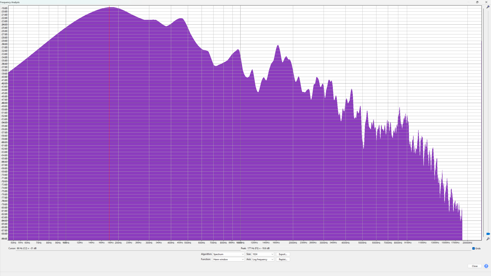
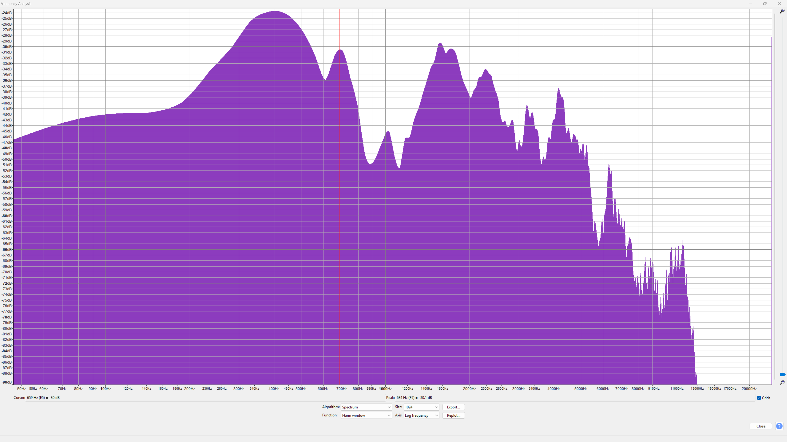

# deepfakeBot

This project, made for the [AI Village](https://aivillage.org/) at [DEFCON 33](https://defcon.org/), showcases how deepfakes work and allows attendees to interact with various real-time generation methods.  

This is an example using [DeepfakeLab](https://github.com/iperov/DeepFaceLab) for synthetic video generation and [ElevenLabs](https://beta.elevenlabs.io/) for synthetic audio generation.  The code is designed to be run on raspberry pi, with a companion computer running the deepfake generation.  This computer can be anything from an old laptop to a modern desktop.  In the example below, both the deepfaked audio and video are of me.  You can use any image or audio set you like, but please get consent from the person you are deepfaking.  This is meant to be a fun example of how easy it is to create deepfakes, and not a tool for malicious use.  

# Table of Contents
- [What are Deepfakes?](#what-are-deepfakes)
- [Creating Deepfakes](#creating-deepfakes)
  - [Facial Landmark Detection](#facial-landmark-detection)
  - [Face Alignment and Swapping](#face-alignment-and-swapping)
- [Detecting Deepfakes](#detecting-deepfakes)
  - [Color Histogram Analysis](#color-histogram-analysis)
- [Audio Deepfakes](#audio-deepfakes)
- [Detecting Audio Deepfakes](#detecting-audio-deepfakes)
  - [Spectrogram Analysis](#spectrogram-analysis)
- [Equipment and Setup](#equipment-and-setup)
  - [Running the Example](#running-the-example)
- [Conclusion](#conclusion)

# What are Deepfakes?

Deepfakes are one of the most well-known and infamous examples of synthetic video generation, with numerous high-profile cases of their misuse. At their most basic, deepfakes are videos that have been manipulated to replace one person's likeness with another's.  Over the years, they have evolved from only being able to edit pre-recorded videos to being able to generate real-time video streams. However, despite the bad reputation deepfakes have earned in the media, their origin is relatively benign. The models used to generate deepfakes are based on ones used by the animation industry for motion capture, which is one of the reasons why they are both so effective and so easy to use. 

Unlike many other synthetic video generation models, deepfakes can be created with relatively little data, and run on almost any modern computer. This makes them accessible to a wide range of users, from hobbyists to professionals.

In this example, we will be performing a 2D face replacement, which is the most common type of deepfake.  This is the technique most often referenced in the media, as it only requires a single image of the target face to create the deepfake.  In our case, we will be using an old headshot of me and projecting it onto a mannequin head.  

## Facial Landmark Detection

Our first step in this technique is to detect the facial features of the host face, in this case, me.  This is done using a facial landmark detection model, which identifies key points on the face such as the eyes, nose, and mouth. In our case, we're using YOLOv5, a relatively older model.  

| Example of Facial Landmark Detection |
|:-----------------------------------:|
|  |
| An example of facial landmark detection within DeepFaceLive.  Here, the model has detected the key points on my face, which will be used to align it and the target face in the code. |

## Face Alignment and Swapping

Once the facial landmarks have been detected, the next step is to align the target face with the host face. At its most basic level, this is done by rotating and scaling the target face, so that the key points from the landmark detection match the key points of the host face. 

After the target face has been aligned, it is then swapped with the host face. This is done by replacing the pixels of the host face with the pixels of the target face, while preserving the facial landmarks.  Most deepfake models will fill in the gaps in the target face with either a simple color fill or a more complex inpainting model, which will attempt to fill in the gaps with pixels that match the surrounding area.  Depending upon the faces being swapped, this can lead to ghosting artifacts, especially around the hairline.  

| Example of Face Alignment and Swapping |
|:--------------------------------------:|
|  |
| An example of the host face (a mannequin) that we will be using for the deepfake. |
|  |
| An example of the target face (me) that we will be using for the deepfake. |
|  |
| An example of the face swapping process, where the target face has been aligned and swapped with the host face. |

And that's it! We now have a deepfake video of me with Vladimir Putin's face. You can use tools like [OBS](https://obsproject.com/) to stream the video in real-time, or you can save it as a video file.

# Detecting Deepfakes

Now that we've shown how easy it is to create a deepfake, let's take a look at how we can detect them in real-time. There are several methods for detecting deepfakes, but my personal favorite is using color histogram analysis. This method is based on the fact that deepfakes often have a different color distribution than real videos, due to the way they are generated.

## Color Histogram Analysis

Histograms are a common tool in computer vision, and they are used to represent the distribution of pixel values in an image. They're often used to compare images and to correct for lighting conditions. In the case of deepfakes, we'll be looking at the individual color channels (red, green, and blue) of the image, and seeing if they match the expected distribution of a real image. The source code for this is: [hist.py](./photos/hist.py), it uses OpenCV to calculate the histograms for each color channel, and then displays them using Matplotlib.

Now let's use [hist.py](./photos/hist.py) to analyze the color histograms of our deepfake photos.  Because my room has a lot of blue in it, the blue channel is not a good indicator of a deepfake, so we will only be looking at the red and green channels.  

| Color Histogram Analysis of the Target Face |
|:----------------------------------:|
|  |
|  |
| Above are the red and green histograms for the target face ([me](./photos/source.png)).  You can see that while they have peaks and valleys, they are relatively smooth and continuous. |

| Color Histogram Analysis of the Control Face |
|:----------------------------------:|
|  |
|  |
| Above are the red and green histograms for the control face ([the mannequin](./photos/control.png)).  You can see that they look a little different from our target face.  The valleys are a lot deeper, and there are a few sharp spikes that stick out.  However, the spikes are discrete and relatively distant from each other.   |

| Color Histogram Analysis of the Deepfake Face |
|:----------------------------------:|
|  |
|  |
| Above are the red and green histograms for the deepfake face ([the deepfake](./photos/test.png)).  You can see that they look very different from both our target and control faces; in fact they don't really look like the target face's histograms at all.  Instead, they look like someone added a bunch of noise to the Control face, because that's exactly what the face replacement algorithm did when filling in the gaps and replacing the original face.  |

The comparison of these histograms shows that the deepfake face has a much noisier distribution of colors, with many sharp spikes and valleys.  This is a strong indicator that the image is a deepfake, as real images tend to have smoother color distributions.  While this method is not foolproof, it is a very quick way to test if an image is a deepfake or not, because it needs only a single image from the video stream to work, making it ideal for doing real-time analysis of video streams as they are running or being uploaded.  Other more advanced methods include using machine learning models to analyze the images, looking for inconsistencies in lighting and shadows, issues with eye blinking, and other artifacts that are common in deepfakes.  However, these methods often require more computational power and are not as easy to implement in real-time scenarios.

# Audio Deepfakes

In addition to video deepfakes, there are also audio deepfakes, which use similar techniques to generate synthetic audio that mimics a person's voice.  In this example, we will be using [ElevenLabs](https://elevenlabs.io/) to generate synthetic audio of myself.  ElevenLabs is a cloud-based service that allows you to create high-quality text-to-speech voices using a small amount of training data that you provide.  In this case, I provided a few minutes of my own voice, and then used the service to generate synthetic audio of myself saying different phrases.  The quality of the generated audio is quite good, and it is often difficult to distinguish it from real audio.

Unlike video deepfakes, most of the software for generating audio deepfakes is cloud-based, with most of the local models being difficult to add new voices to.  An example of a local model is [voice-changer](https://github.com/w-okada/voice-changer).  

# Detecting Audio Deepfakes

Audio deepfakes are interesting, because while they are also relatively old, they respond very well to things like model tagging and watermarking.  This is because human hearing can only hear a limited range of frequencies, and most audio deepfake models will add noise to the audio that is outside of this range.  Audio models have a long history of using these kinds of watermarks to identify synthetic audio, Google used to use a similar technique to identify audio from commercials to prevent them from activating their voice assistants.  Regardless of whether you are adding or removing noise to create a watermark, one of the best ways to visualize and analyze audio deepfakes is to use spectrogram analysis.

## Spectrogram Analysis

Spectrograms are a common tool in audio analysis, and they are used to represent the frequency content of an audio signal over time. They are often used in speech recognition, music analysis, and other applications. In our case, we'll be using [Audacity](https://www.audacityteam.org/) to generate spectrograms of our audio samples.  These samples are both me and the synthetic audio counting from one to ten.

| Spectrogram Analysis of Real and Synthetic Audio |
|:----------------------------------:|
|  |
| This is the spectrogram of my real voice counting from one to ten.  While the spectrogram gets a little noisy at the higher frequencies, it is relatively smooth and continuous, forming a gentle hill as it looks at the different frequencies that make up my voice. |
|  |
| This is the spectrogram of the synthetic audio generated by ElevenLabs of my voice counting from one to ten.  Two big things that stick out as different are the spike at 400 Hz and the valley at 1 kHz. |

Audio comparisons are a little more difficult to do than image comparisons because you need to have the audio files to compare, and the recording and speaker quality can have a big impact on the analysis.  For example, here we are playing the synthetic audio through a speaker and recording it with a microphone, which adds a lot of noise to the signal.  However, even with this added noise, you can still see two weird artifacts in the distribution of frequencies, which could be used to detect that the audio is synthetic.  I haven't been able to find any documentation from ElevenLabs about whether they add a watermark to their audio, but multiple posts on Reddit have indicated that they do.  More than likely, the valley at 1kHz is probably their watermark, while the 400 Hz spike is a side effect of generating audio from a cheap speaker and then recording it into a cheap microphone.  

# Equipment and Setup

Hardware:
- Raspberry Pi 4 or 5
  - the demo uses cloud based AI models, so you don't need a newer model, but you can use a more powerful pi if you want to run the models locally
- USB Camera
  - this is used to capture the video stream of the host face
- USB Microphone
  - this is used to capture audio input for the robot
- USB Speaker
  - this is used to play the audio output of the robot
- Mannequin Head (optional, but recommended if you want to have a physical representation of the deepfake)
  - I got mine from [Amazon](https://www.amazon.com/dp/B08FJ4KQVF) for $23
- Servo Controller (optional, but recommended if you want to have a physical representation of the deepfake)
  - I used a [PCA9685](https://www.adafruit.com/product/815) servo controller, but you can use any servo controller that works with the Raspberry Pi
- Pan and Tilt Servos (optional, but recommended if you want to have a physical representation of the deepfake)
  - I used [Yahboom Pan and Tilt Servos](https://www.amazon.com/Yahboom-Pan-Tilt-Electric-Platform-Accessories/dp/B0BRXVFCKX)

The code to run the demo is [bot.py](./bot.py).  Note you will need an account with ElevenLabs to use the audio generation, and you will need to set your API key in billing config file.  You will also need an OpenAI API key, because I use Whisper for speech to text.  The [billing.yml sample file](./configs/billing.yaml.sample) shows where to put your keys.  

You will also need to set up DeepFaceLive on a separate computer, and give it the target face image.  Unfortunately, running it on the pi itself isn't really feasible, as it requires a lot of computational power.  You can use any computer that has a decent GPU, for example I use an old Razor laptop with an Nvidia GPU.  

